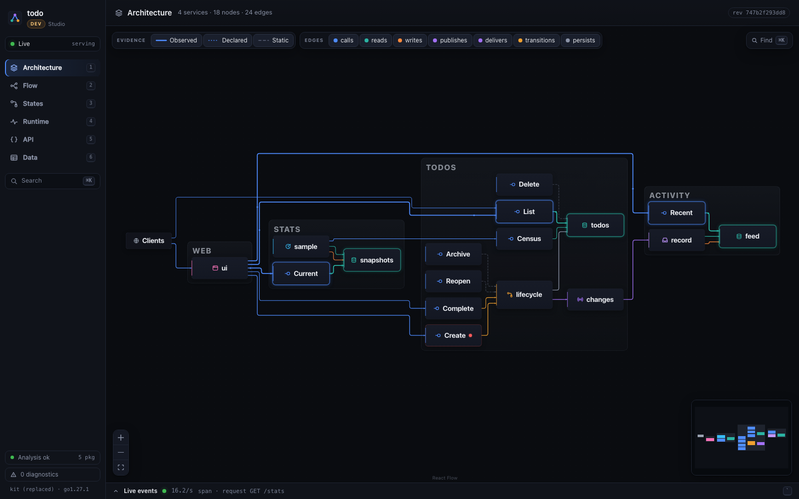
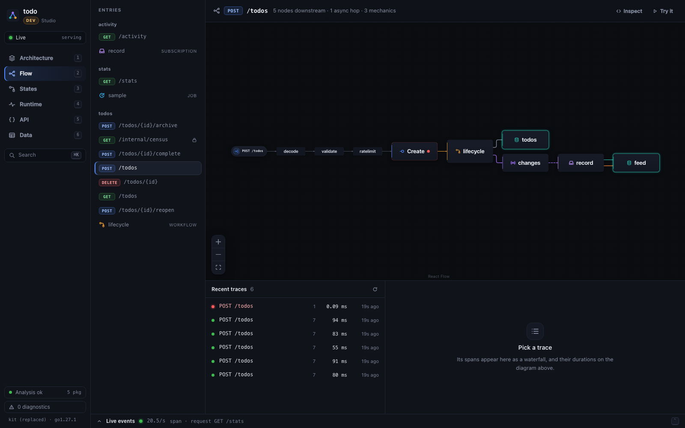
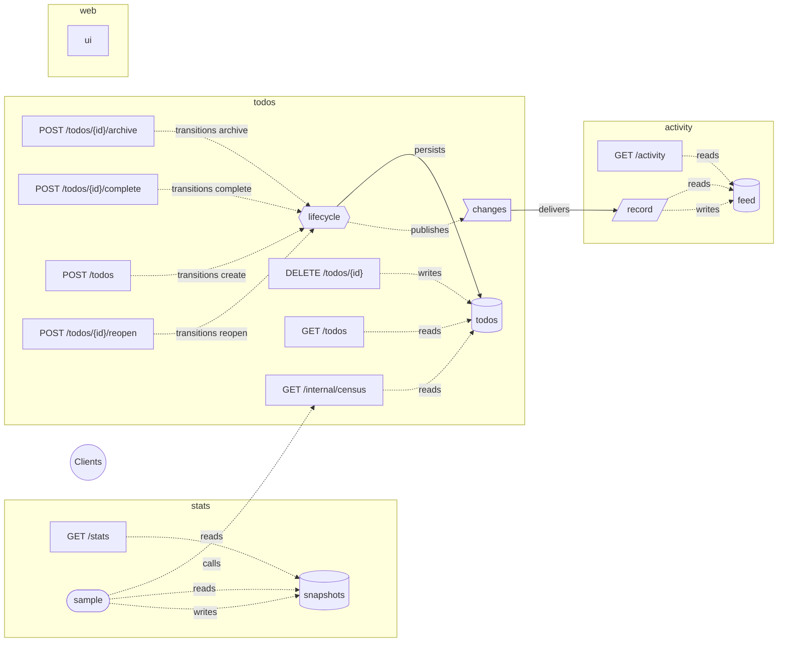
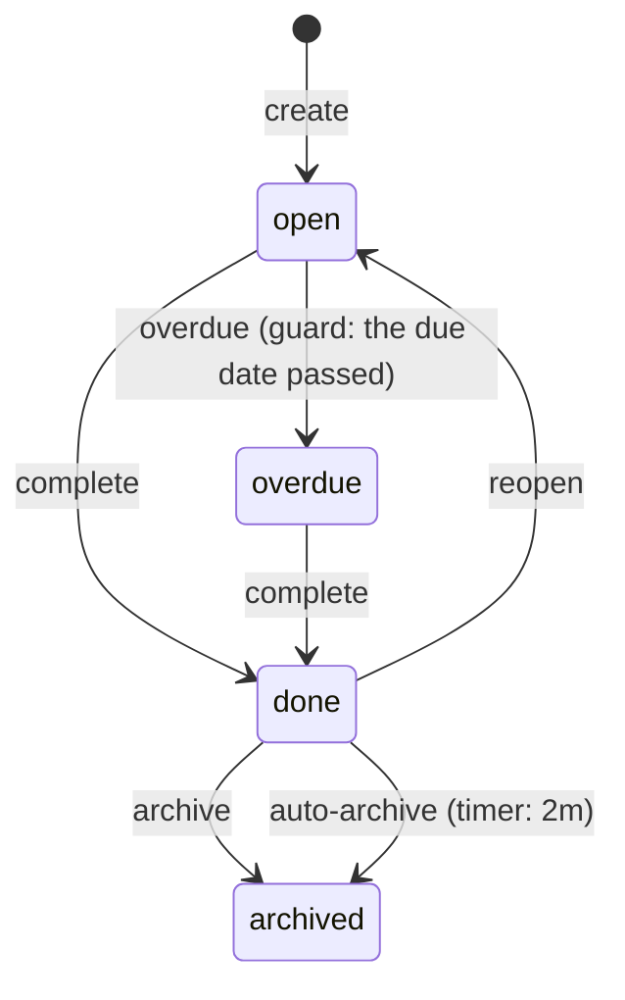

# todo

The first product built with [kit](https://github.com/kitsunium/platform): a
todo list whose architecture is its own diagram.

Four services in one binary:

- **todos** owns the list and the lifecycle of every todo, a workflow.
  Endpoints fire its events. Its own loop fires the timed and guarded
  transitions: a todo whose due date passes becomes *overdue*, and a done todo
  is archived after two minutes.
- **activity** keeps a feed of every change, received through the
  `todos.changes` topic.
- **stats** samples the list every ten seconds, a loop of the daemon, through
  a private endpoint of `todos`.
- **web** serves the user interface.


## The product, as its diagram

In dev, the product serves its own diagram at `/_kit/` — the kit Studio, live:

| Architecture | Flow of `POST /todos` |
|---|---|
|  |  |
| **States** — the lifecycle, with its live population | **Runtime** — the daemon's internal loop |
|  |  |


Generated by `kit graph -format mermaid`. Solid arrows exist by construction;
dashed ones were found in the code by the static analysis. In the Studio they
also carry what the running product observed.



## Run it

The platform is developed next to this repository until it is published:

```sh
git clone https://github.com/kitsunium/platform ../platform
go install ../platform/cmd/kit

kit dev    # http://localhost:4000        the app
           # http://localhost:4000/_kit/  the app, as a diagram
```

`kit dev` rebuilds and restarts the product on every save. Data lives in
`.kit/data`.

## The lifecycle of a todo



## API

| Endpoint | |
|---|---|
| `GET /todos?status=` | the list, newest first |
| `POST /todos` | `{"title": "…", "due": "RFC 3339, optional"}` |
| `POST /todos/{id}/complete` | open or overdue → done |
| `POST /todos/{id}/reopen` | done → open |
| `POST /todos/{id}/archive` | done → archived |
| `DELETE /todos/{id}` | removes it |
| `GET /activity` | the 30 latest changes |
| `GET /stats` | the latest sample and the history |

## Deploy

One static binary, anywhere:

```sh
KIT_DATA_DIR=/var/lib/todo ./todo         # production: no Studio, data on disk
./todo healthcheck                        # exit 0 when ready: for any supervisor
./todo graph                              # the product graph, as JSON
```

With Docker, the platform checkout next to this one is a named build context:

```sh
docker build --build-context platform=../platform -t todo .
docker run -p 4000:4000 -v todo-data:/data todo
```

The image is distroless, runs as non-root, keeps its data in the `/data`
volume, and checks its own health with `todo healthcheck`.

## Test

```sh
go test -race ./...
```

`TestTheDiagramMatchesTheCode` runs the product with its static analysis and
checks that the diagram and the code agree: every node declared in the code is
served, has its source, its handler and its documentation, every event of the
lifecycle is fired by an endpoint, and a call from the page is drawn from the
page. `TestTheReadmeDiagramIsCurrent` fails when the diagram above no longer
matches the code: regenerate it with `go run . graph -format mermaid`.
